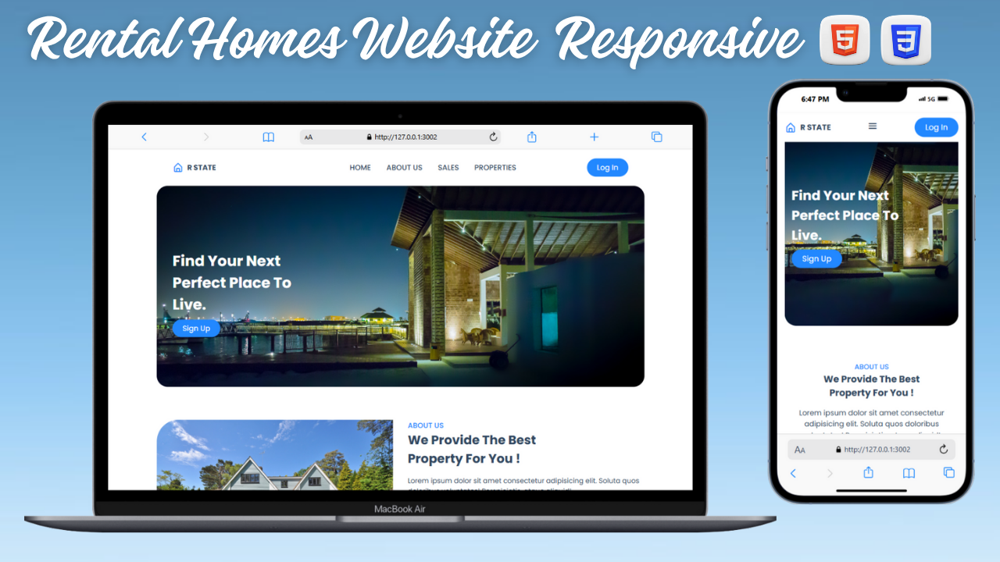

# 🏠 Rental Houses – Responsive Frontend UI

A clean, modern, and fully responsive rental housing website built using only **HTML & CSS**.  
This project demonstrates layout mastery, responsiveness, smooth transitions, and attention to UI/UX details — across all screen sizes from **mobile** to **wide desktops**.

---

## 🌐 Live Demo

🔗 **[View Live Project](https://nufail-01.github.io/Rental-Homes/)**

---

## ✨ Project Highlights

- ✅ Built with pure **HTML5** and **CSS3** only — no JavaScript
- 📱 **Fully responsive** design (Mobile → Tablet → Laptop → Desktop)
- 🎨 Clean, professional **layout and visual hierarchy**
- 💨 Smooth transitions and hover effects
- 🧠 Follows **modern UI/UX design principles**
- 💡 Proper use of **semantic HTML** and structured CSS
- 🛠️ Optimized for readability and maintainability

---

## 🧠 What I Learned

- Structuring HTML semantically for better accessibility
- Creating responsive layouts with media queries
- Using CSS Grid and Flexbox together for flexible design
- Designing UI that adapts gracefully across screen sizes
- Improving visual design with spacing, fonts, and hierarchy
- Building smooth transitions using only CSS

---

## 🧪 Challenges Faced

- Handling layout shifts on extremely small screens  
- Ensuring consistent spacing and alignment across sections  
- Balancing visual appeal with clean, readable code  
- Maintaining responsiveness without adding JavaScript or frameworks

---

## 🛠️ Tech Stack

- ✅ HTML5  
- ✅ CSS3  
- ✅ CSS Grid / Flexbox  
- ✅ Media Queries  
- 🔗 GitHub Pages (for deployment)

---
---
---
